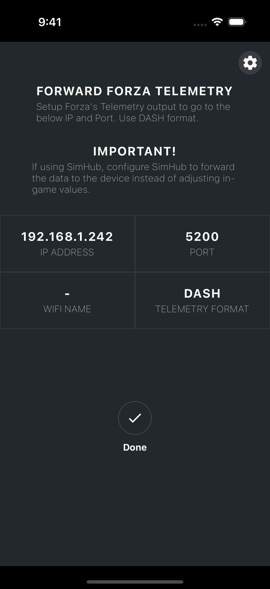
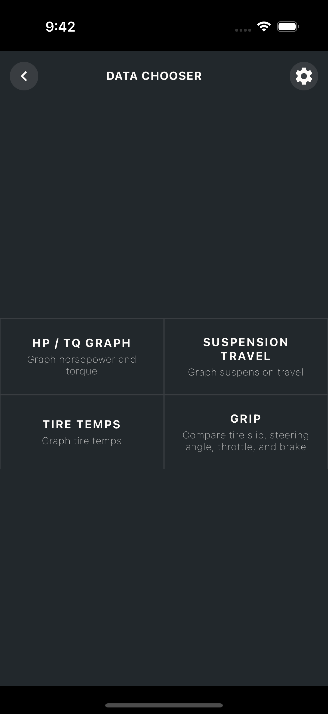

# forzautils_reactnative
Forza Utility written in React Native.

#### NOTE: This repo is still new and under development!

## React Native Mobile App

This is a mobile app for iOS and Android for viewing Forza telemetry data.

Build and deploy the app per React Native workflow:

1. `yarn install`

1. `yarn build`

1. `yarn run <ios | android>`

### First Screen

Shows the IP and Port, optionally the WiFi name the device is connected to, if you allowed Location permission.

### Second Screen

Shows various data viewer options

