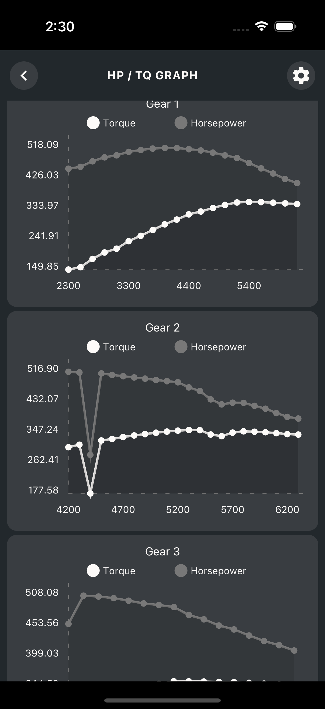
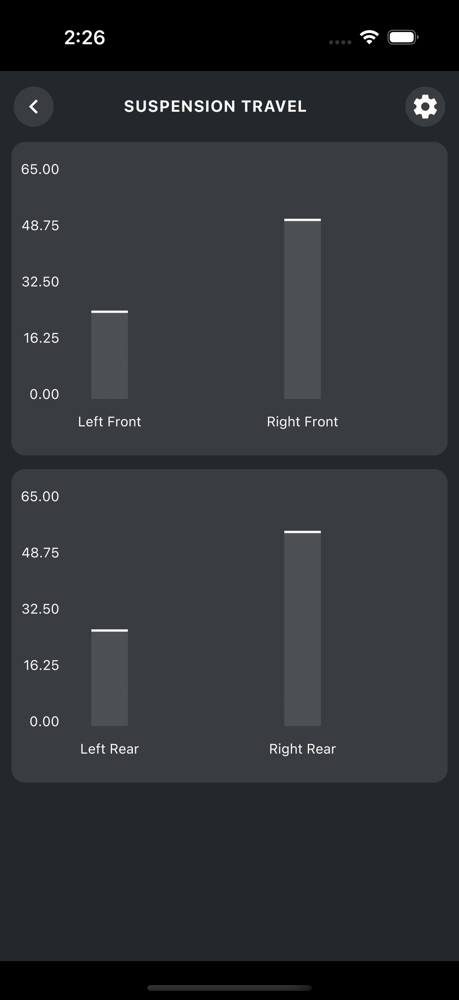
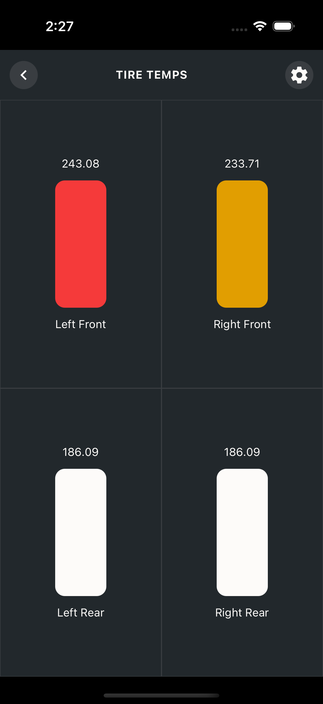

# forzautils_reactnative
Forza Utility written in React Native.

#### NOTE: This repo is still new and under development!

## React Native Mobile App

Clone: [ForzaTelemetryAPI](https://github.com/dusanders/ForzaTelemetryAPI_typescript) at the project root - it is required by this app at: `../../ForzaTelemetryAPI_typescript`

This is a mobile app for iOS and Android for viewing Forza telemetry data.

Build and deploy the app per React Native workflow:

1. `yarn install`

1. `yarn build`

1. `yarn run <ios | android>`

### First Screen

Shows the IP and Port, optionally the WiFi name the device is connected to, if you allowed Location permission.

### Second Screen

Shows various data viewer options

### Hp / Tq Graph

Shows a graphed output of the Horsepower and Torque ratings of the car as you drive. 

Graphs are broken down into each gear - excluding Reverse gear

**NOTE:** Shifts are represented with a sharp decrease in power if the game settings are set to `auto clutch`. This is Forza pulling power shortly after a shift event.

### Suspension Travel

Shows 4 bar graphs that represent the suspension travel of each wheel. 

Values range from 0 to ~70 

### Tire Temps

Shows color changing blocks and numeric output of the tire temps while driving

